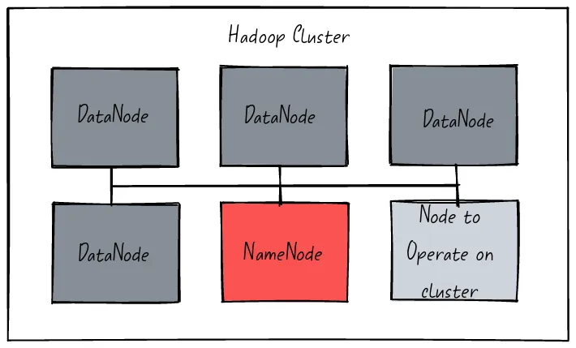
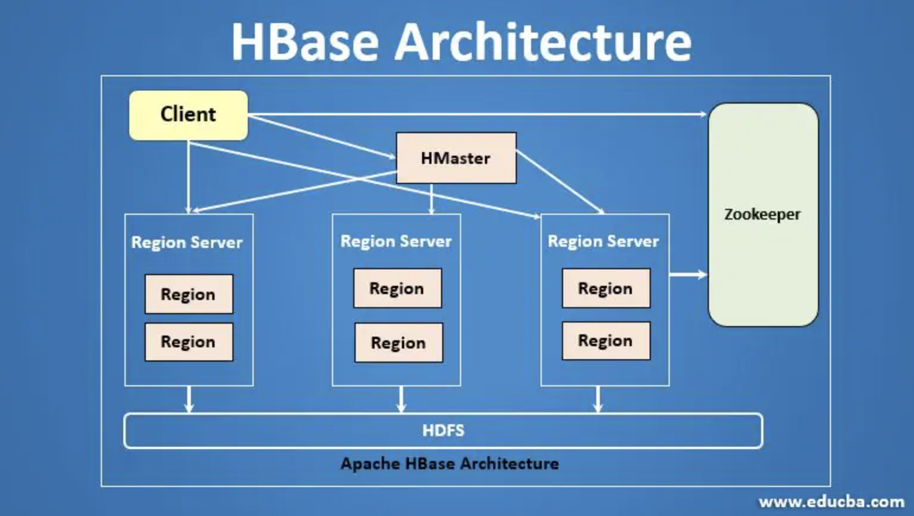
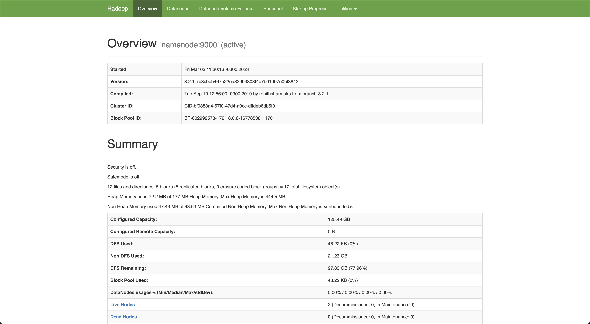
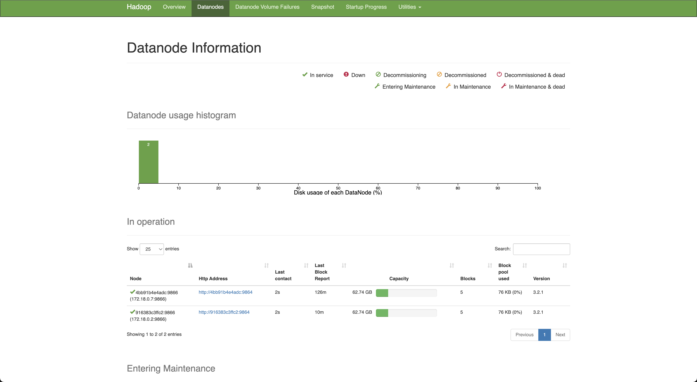

# Hadoop Hbase Docker
Running jobs using Docker


HDFS, or Hadoop Distributed File System, is a distributed file system designed to store and
process large datasets using commodity hardware. It is part of the Apache Hadoop ecosystem
and is widely used in big data processing. HDFS uses a master-slave architecture with one
NameNode and multiple DataNodes. The NameNode manages the file system metadata, while the
DataNodes store the actual data. This allows for scalable and fault-tolerant data storage
and processing. HDFS is optimized for batch processing and sequential reads, making it
well-suited for applications like log analysis, data warehousing, and machine learning.
However, it is not well suited for random writes and low-latency data access. HDFS is a
critical component of the Hadoop ecosystem and is used by many big data applications.
Its scalable and fault-tolerant design makes it a reliable choice for storing and
processing large datasets. Overall, HDFS plays a crucial role in the world of big
data and is an essential tool for data engineers and analysts.



HBase is a distributed, non-relational database built on top of the Hadoop Distributed File System
(HDFS). It is an open-source project that provides a scalable, fault-tolerant way to store and
retrieve large amounts of sparse data.

HBase is designed to store large amounts of data in a way that can be easily accessed and
processed in near real-time. It is modeled after Google's Bigtable, a distributed database
system used by Google to store structured data. HBase uses a key-value data model, where
each row in the database is identified by a unique key and consists of multiple columns
of data. Each row can have a different set of columns, and columns can be added or removed
dynamically without affecting the rest of the data.



## Software Architecture

|File|Purpose|
|---|---|
|[docker-compose.yml](docker-compose.yml)|Docker compose with the infrastructure required to run the Hadoop cluster.|
|[requirements.txt](tests/requirements.txt)|Python requirements file.|
|[app/test_hdfs.py](tests/test_hdfs.py)|Python script that tests writing data into HDFS.|
|[app/test_hbase.py](tests/test_hbase.py)|Python script that tests writing data into HBase.|

## References

- [Docker Hadoop](https://github.com/big-data-europe/docker-hadoop)
- [HDFS Simple Docker Installation Guide for Data Science Workflow](https://towardsdatascience.com/hdfs-simple-docker-installation-guide-for-data-science-workflow-b3ca764fc94b)
- [Set Up Containerize and Test a Single Hadoop Cluster using Docker and Docker compose](https://www.section.io/engineering-education/set-up-containerize-and-test-a-single-hadoop-cluster-using-docker-and-docker-compose/)=
- [Spark Docker](https://github.com/big-data-europe/docker-spark)
- [Hadoop Namenode](https://hub.docker.com/r/bde2020/hadoop-namenode)
- [Apache ZooKeeper](https://zookeeper.apache.org/)
- [Docker Hbase](https://github.com/big-data-europe/docker-hbase)
- [HappyBase](https://happybase.readthedocs.io/en/latest/)

## Instructions

#### Starting the Hadoop ecosystem
```bash
docker rm -f $(docker ps -a -q)
docker volume rm $(docker volume ls -q)
docker-compose up
```

#### Validating the status of the Hadoop cluster
```bash
docker ps
```
```bash
CONTAINER ID        IMAGE                                                    COMMAND                  CREATED             STATUS                    PORTS                                            NAMES
0f87a832960b        bde2020/hadoop-resourcemanager:2.0.0-hadoop3.2.1-java8   "/entrypoint.sh /r..."   12 hours ago        Up 54 seconds             0.0.0.0:8088->8088/tcp                           yarn
51da2508f5b8        bde2020/hadoop-historyserver:2.0.0-hadoop3.2.1-java8     "/entrypoint.sh /r..."   12 hours ago        Up 55 seconds (healthy)   0.0.0.0:8188->8188/tcp                           historyserver
ec544695c49a        bde2020/hadoop-nodemanager:2.0.0-hadoop3.2.1-java8       "/entrypoint.sh /r..."   12 hours ago        Up 56 seconds (healthy)   0.0.0.0:8042->8042/tcp                           nodemanager
810f87434b2f        bde2020/hadoop-datanode:2.0.0-hadoop3.2.1-java8          "/entrypoint.sh /r..."   12 hours ago        Up 56 seconds (healthy)   0.0.0.0:9864->9864/tcp                           datenode1
ca5186635150        bde2020/hadoop-namenode:2.0.0-hadoop3.2.1-java8          "/entrypoint.sh /r..."   12 hours ago        Up 56 seconds (healthy)   0.0.0.0:9000->9000/tcp, 0.0.0.0:9870->9870/tcp   namenode
beed8502828c        bde2020/hadoop-datanode:2.0.0-hadoop3.2.1-java8          "/entrypoint.sh /r..."   12 hours ago        Up 55 seconds (healthy)   0.0.0.0:9865->9864/tcp                           datenode2
[...]
```

#### Testing HDFS using raw HTTP requests.
The `-L` flag allows redirections. By default, the namenode redirects the request to any of the datanodes.
````bash
docker exec -it namenode /bin/bash
curl -L -i -X PUT "http://127.0.0.1:9870/webhdfs/v1/data/martin/lorem-ipsum.txt?op=CREATE" -d 'testing'
````
````bash
HTTP/1.1 307 Temporary Redirect
Date: Thu, 30 Mar 2023 00:40:44 GMT
Cache-Control: no-cache
Expires: Thu, 30 Mar 2023 00:40:44 GMT
Date: Thu, 30 Mar 2023 00:40:44 GMT
Pragma: no-cache
X-Content-Type-Options: nosniff
X-FRAME-OPTIONS: SAMEORIGIN
X-XSS-Protection: 1; mode=block
Location: http://datanode2.martincastroalvarez.com:9864/webhdfs/v1/data/martin/lorem-ipsum.txt?op=CREATE&namenoderpcaddress=namenode:9000&createflag=&createparent=true&overwrite=false
Content-Type: application/octet-stream
Content-Length: 0

HTTP/1.1 100 Continue

HTTP/1.1 201 Created
Location: hdfs://namenode:9000/data/martin/lorem-ipsum.txt
Content-Length: 0
Access-Control-Allow-Origin: *
Connection: close
````

#### Generating an HDFS report
```bash
docker exec -it namenode /bin/bash
hdfs dfsadmin -report
```
```bash
Configured Capacity: 134743154688 (125.49 GB)
Present Capacity: 82729581610 (77.05 GB)
DFS Remaining: 82729099596 (77.05 GB)
DFS Used: 482014 (470.72 KB)
DFS Used%: 0.00%
Replicated Blocks:
	Under replicated blocks: 20
	Blocks with corrupt replicas: 0
	Missing blocks: 0
	Missing blocks (with replication factor 1): 0
	Low redundancy blocks with highest priority to recover: 0
	Pending deletion blocks: 0
Erasure Coded Block Groups: 
	Low redundancy block groups: 0
	Block groups with corrupt internal blocks: 0
	Missing block groups: 0
	Low redundancy blocks with highest priority to recover: 0
	Pending deletion blocks: 0

-------------------------------------------------
Live datanodes (2):

Name: 172.18.0.3:9866 (datenode2.hbase)
Hostname: 2d1fd8baa6d8
Decommission Status : Normal
Configured Capacity: 67371577344 (62.74 GB)
DFS Used: 241007 (235.36 KB)
Non DFS Used: 22285652625 (20.76 GB)
DFS Remaining: 41364549798 (38.52 GB)
DFS Used%: 0.00%
DFS Remaining%: 61.40%
Configured Cache Capacity: 0 (0 B)
Cache Used: 0 (0 B)
Cache Remaining: 0 (0 B)
Cache Used%: 100.00%
Cache Remaining%: 0.00%
Xceivers: 5
Last contact: Wed Mar 29 23:48:03 UTC 2023
Last Block Report: Wed Mar 29 23:33:12 UTC 2023
Num of Blocks: 20

Name: 172.18.0.8:9866 (datenode1.hbase)
Hostname: 8fcae28c9732
Decommission Status : Normal
Configured Capacity: 67371577344 (62.74 GB)
DFS Used: 241007 (235.36 KB)
Non DFS Used: 22285652625 (20.76 GB)
DFS Remaining: 41364549798 (38.52 GB)
DFS Used%: 0.00%
DFS Remaining%: 61.40%
Configured Cache Capacity: 0 (0 B)
Cache Used: 0 (0 B)
Cache Remaining: 0 (0 B)
Cache Used%: 100.00%
Cache Remaining%: 0.00%
Xceivers: 5
Last contact: Wed Mar 29 23:48:03 UTC 2023
Last Block Report: Wed Mar 29 23:33:12 UTC 2023
Num of Blocks: 20
```

#### Listing the content of the root directory
```bash
docker exec -it namenode /bin/bash
hdfs dfs -ls /
```
```bash
Found 1 items
drwxr-xr-x   - root supergroup          0 2023-03-03 14:15 /rmstate
```

#### Creating a new directory in HDFS
```bash
docker exec -it namenode /bin/bash
hdfs dfs -mkdir -p /user/root
hdfs dfs -ls /
```
```bash
Found 2 items
drwxr-xr-x   - root supergroup          0 2023-03-03 14:15 /rmstate
drwxr-xr-x   - root supergroup          0 2023-03-03 14:17 /user
```

#### Adding a file to HDFS
```bash
docker exec -it namenode /bin/bash
echo "lorem" > /tmp/hadoop.txt 
hdfs dfs -put ./input/* input
hdfs dfs -ls /user/
```
```bash
Found 2 items
-rw-r--r--   3 root supergroup          6 2023-03-03 14:20 /user/hadoop.txt
drwxr-xr-x   - root supergroup          0 2023-03-03 14:17 /user/root
```

#### Printing the content of a file in HDFS
```bash
docker exec -it namenode /bin/bash
hdfs dfs -cat /user/hadoop.txt 
```
```bash
lorem
```

#### Checking the status of the NameNode at [http://127.0.0.1:9870/dfshealth.html](http://127.0.0.1:9870/dfshealth.html)




#### Testing HDFS using Python

```python3
virtualenv -p python3 .env
source .env/bin/activate
pip install -r requirements.txt
python3 app/test_hdfs.py
```
```bash
WARNING: Replacing datanode2 with localhost.
201 Created
WARNING: Replacing datanode2 with localhost.
WARNING: Replacing datanode2 with localhost.
a.txt
data
hello.txt
test2.json
```

#### Starting the Thrift server inside the HBase container
```bash
docker exec -it hbase hbase thrift --port 9090 start
```

#### Testing the HBase service using Python
```python3
virtualenv -p python3 .env
source .env/bin/activate
pip install -r requirements.txt
python3 app/test_hbase.py
```
```bash
Table:
[b'martin', b'martin2']
Table: <happybase.table.Table name=b'martin2'>

Put:

Row by ID:
{b'cfv1:attr1': b'value1', b'cfv1:attr2': b'value2', b'cfv1:attr3': b'value3', b'cfv2:attr1': b'value4', b'cfv2:attr2': b'value5', b'cfv3:attr1': b'value6'}

Query by IDs:
b'nisman1' --> {b'cfv1:attr1': b'value1', b'cfv1:attr2': b'value2', b'cfv1:attr3': b'value3', b'cfv2:attr1': b'value4', b'cfv2:attr2': b'value5', b'cfv3:attr1': b'value6'}
b'nisman2' --> {b'cfv1:attr10': b'x1', b'cfv1:attr20': b'x2', b'cfv2:attr10': b'x3', b'cfv3:attr10': b'x4'}

Scan with Prefix:
b'nisman' --> {b'cfv1:attr1': b'value1', b'cfv1:attr2': b'value2', b'cfv1:attr3': b'value3', b'cfv2:attr1': b'value4', b'cfv2:attr2': b'value5', b'cfv3:attr1': b'value6'}
b'nisman1' --> {b'cfv1:attr1': b'value1', b'cfv1:attr2': b'value2', b'cfv1:attr3': b'value3', b'cfv2:attr1': b'value4', b'cfv2:attr2': b'value5', b'cfv3:attr1': b'value6'}
b'nisman2' --> {b'cfv1:attr10': b'x1', b'cfv1:attr20': b'x2', b'cfv2:attr10': b'x3', b'cfv3:attr10': b'x4'}
b'nisman3' --> {b'cfv1:attr10': b'lorem-ipsum'}

Delete:
None
```
